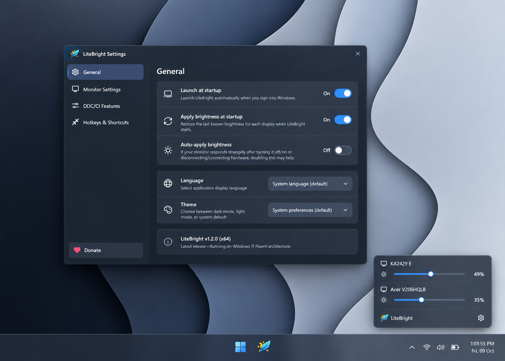
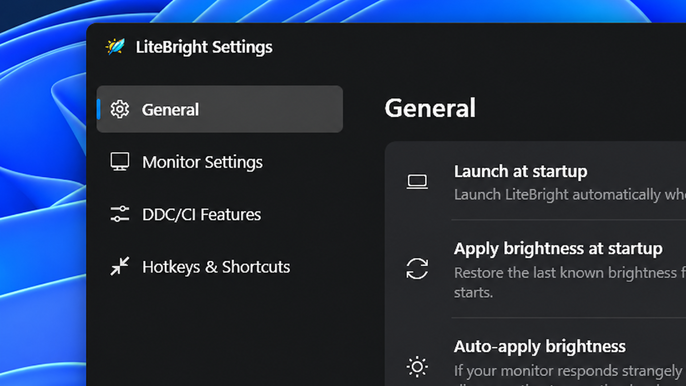
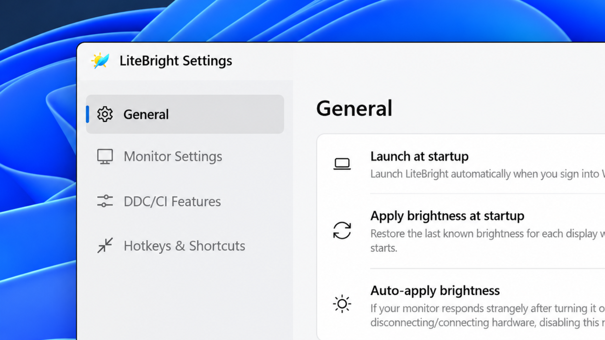

<p align="center">
  
</p>
<h1 align="center">LiteBright</h1>

<p align="center">
  <a href="https://github.com/SN7k/LiteBright/releases" target="_blank"></a>
  <a href="https://github.com/SN7k/LiteBright/releases" target="_blank"></a>
  <a href="https://apps.microsoft.com/detail/9NTLVZDLPPK5" target="_blank"></a>
</p>

<p align="center">
  <a href="https://ko-fi.com/snkdevworks" target="_blank"></a>
  <a href="https://buymeacoffee.com/sn7k" target="_blank"></a>
  <a href="https://paypal.me/ShombhuKaran" target="_blank"></a>
</p>

LiteBright enables seamless brightness and contrast control on external displays and laptop screens in Windows 10 & 11. Even though Windows is capable of adjusting the backlight on built-in laptop displays, it doesn't support external monitors natively, and lacks options to manage multiple displays simultaneously. LiteBright inserts a clean, modern icon into your system tray, where you can click to have instant access to the brightness and contrast levels of all connected displays.

<br>



<br>

## Features

- Adds smooth brightness sliders to the system tray, similar to the built-in Windows volume flyout.
- Seamlessly blends in with Windows 10 and Windows 11 with native Fluent Design, rounded corners, and acrylic effects.
- Adjust brightness in real time by simply scrolling your mouse wheel over the system tray icon or monitor cards.
- Bind customizable global keyboard shortcuts (hotkeys) to adjust brightness up/down per monitor or across all displays.
- Hardware DDC/CI support for external desktop monitors and WMI support for built-in laptop screens.
- Independent contrast control slider alongside brightness.
- Automatically follows your Windows theme (Dark / Light) and personal accent colors.
- Starts up natively with Windows on login (official Windows Startup Task integration).
- Multi-language localization with 35+ supported languages.
- Ultra-lightweight with zero background CPU or memory overhead.

<br>

### Design & Personalization

LiteBright automatically adapts its appearance to match your Windows version and personal theme preferences. Easily switch between Dark and Light mode or let it follow system preferences.

<p align="center">
  
  
</p>

<br>

## Download

**Download the latest version from the [Microsoft Store](https://apps.microsoft.com/detail/9NTLVZDLPPK5) or the [Releases page](https://github.com/SN7k/LiteBright/releases/latest).**

<br>

<a href="https://apps.microsoft.com/detail/9NTLVZDLPPK5" target="_blank">
  
</a>

<br><br>

### Releases

| Version | Date | Notes | Download |
|---|---|---|---|
| **1.2.1** | Oct 2026 | Self-contained (bundled .NET runtime), native Windows startup task, Microsoft Store release | [Download (.exe)](https://github.com/SN7k/LiteBright/releases/download/v1.2.1/LiteBright-Setup-1.2.1.exe) |
| **1.2.0** | Oct 2026 | Windows 11 Fluent context menu, in-window dropdowns, 35+ languages, DDC/CI telemetry | [Download (.exe)](https://github.com/SN7k/LiteBright/releases/download/v1.2.0/LiteBright-Setup-1.2.0.exe) |
| **1.0.0** | Feb 2026 | Initial release | [Download (.exe)](https://github.com/SN7k/LiteBright/releases/download/v1.0.0/LiteBright-Setup-1.0.0.exe) |

<br>

## Install via Package Manager

### Windows Package Manager (Winget)

```powershell
winget install SN7k.LiteBright
```

To upgrade to the latest version via winget:

```powershell
winget upgrade SN7k.LiteBright
```

<br>

## Usage

- Download from the [Releases page](https://github.com/SN7k/LiteBright/releases/latest) or install from the [Microsoft Store](https://apps.microsoft.com/detail/9NTLVZDLPPK5).
- Once started, LiteBright runs quietly in your notification area (system tray).
- Click the tray icon to bring up the brightness and contrast control panel.
- Hover over the tray icon or monitor cards and scroll your mouse wheel to adjust brightness instantly.
- Right-click the system tray icon to open Settings, view monitor diagnostics, or quit.

<br>

## Compatibility

LiteBright uses hardware **DDC/CI** and Windows **WMI** to communicate with displays:
- **External Monitors:** Compatible with monitors supporting DDC/CI over DisplayPort, HDMI, and USB-C. Ensure DDC/CI is enabled in your monitor's physical On-Screen Display (OSD) settings menu.
- **Laptop Displays:** Controlled via Windows Management Instrumentation (WMI).
- **Supported OS:** Windows 10 (1809 or higher) and Windows 11 (x64).
- **Prerequisites:** None required! The app is 100% self-contained with the .NET runtime bundled inside.

<br>

## Sponsor this project

If you enjoy using LiteBright and want to support ongoing development, maintenance, and new features:

- ☕ **Ko-fi:** [ko-fi.com/snkdevworks](https://ko-fi.com/snkdevworks)
- 💛 **Buy Me a Coffee:** [buymeacoffee.com/sn7k](https://buymeacoffee.com/sn7k)
- 💳 **PayPal:** [paypal.me/ShombhuKaran](https://paypal.me/ShombhuKaran)

<br>

## License

LiteBright is licensed under the [MIT License](LICENSE).
